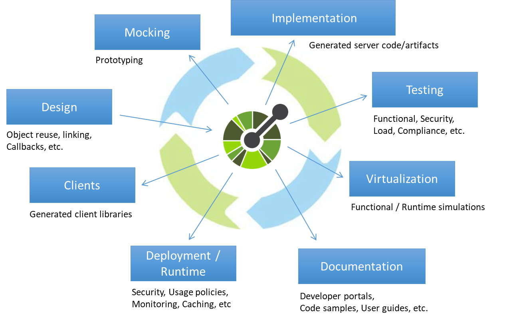
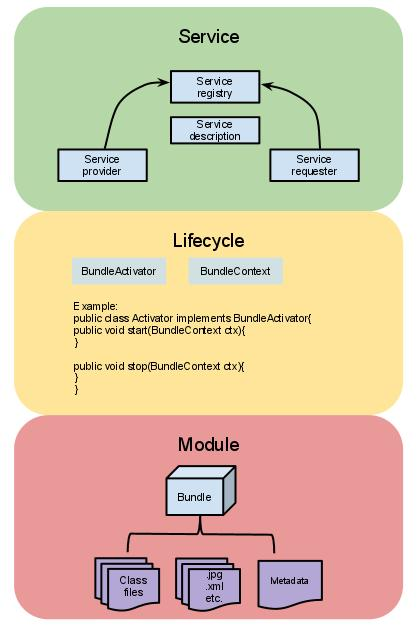
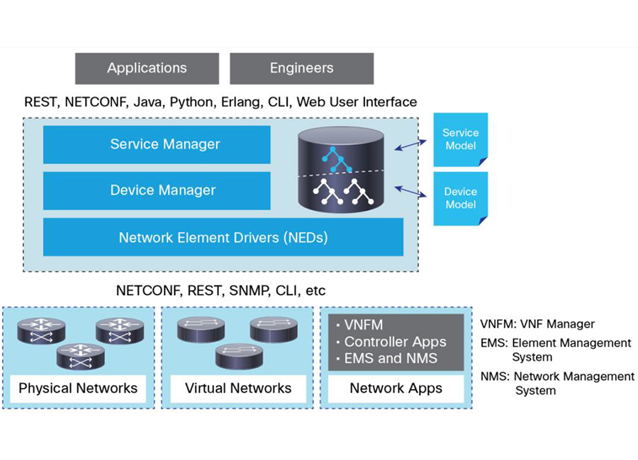
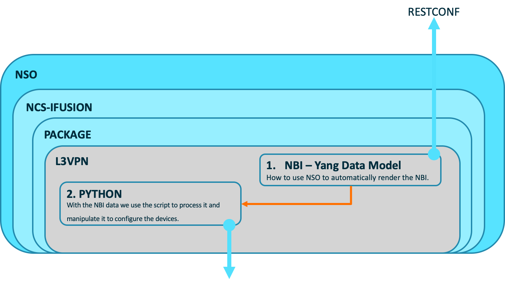

# SDN Automation with NSO

## Course Structure

### Basic Concepts:

1. Web Services Architecture
   1. Introduction
   2. Basic Architecture
   3. Web Service Description Language
   4. Web Service Architecture Stack
2. Python Basics
   2. Python Data Structures
   3. Python Control Flow
   4. Python I/O
   5. Python Functions
   6. Python Operators
3. Git Basics
4. APIs and OpenAPI
5. YANG, YAML, JSON...
6. SOAP, gRPC, REST, Netconf, Restconf..
7. Network controller architectures

### NSO Overview

### NSO System Admin:

1. NSO Architecture
2. NSO System Operations
   1. How Start (Installation)
   2. How Monitor
   3. How Config
   4. How Backup and Restore (File system)
   5. Database Management
3. NSO Package Overview
4. Troubleshooting
5. Disaster Management

### NSO System User

1. NSO CLI
2. Device Manager
3. SSH Key Management
4. Network Services
5. Alarm Manager
6. Web User Interface
7. Network Simulator

### NSO Developers

1. Architecture
2. Python VM
3. Troubleshooting
4. NBI:  Yang Model
5. SBI: NED Component
6. Subscriptions
7. APIs (Java & Py)
8. Service Packages

---

# Basic Concepts

This chapter covers the following topics:

- What is an APIs
- What is it an Web Service Architecture

## Web Services Architecture 

For communicating with and configuring networks, software developers commonly use application programming interfaces (APIs). 

APIs are mechanisms used to communicate with applications and other software. 

They are also used to communicate with various components of a network through software. A developer can use APIs to configure or monitor specific components of a network. Although there are multiple different types of APIs, this chapter focuses on two of the most common APIs: 

- Northbound APIs
- Southbound APIs. 

<p align="center"></p>


### Introduction

A web service is a part of a message that communicates from one system to another, where the message can be in XML or JSON format, and is characterised by these two features:

- Multi-platform: client and server do not have to have the same configuration to communicate. The web service makes this possible.

- Distributed: in general, a web service is not available to a single client, but is accessed by different clients over the Internet.

The architecture of a web service is designed taking into account the different tasks that the service is expected to perform, such as Service Provider, Service Registry and Service Requester. In addition, a web service is expected to flow through the network with the help of protocols following the SOA architecture and the endpoint URL called WSDL (Web Services Description Language).

### Basic Architecture

The fundamental architecture incorporates the following:

- Publish: In this operation, a service description must be published so that a service requester can find the service.

- Find: In this operation, the service requestor directly retrieves the service description. 

  It is involved in two different lifecycle phases:

  - At the design time to retrieve the service’s interface description for program development.
  - At the runtime to retrieve the service’s binding and the location description for invocation.

- Bind: In this operation, the service requestor calls or initiates an interaction with the service at runtime only using the binding details available in the service description to locate, contact, and call the service.

There are three roles of web service architecture:

- Service Provider: It is the platform that hosts the services. It creates web service and makes it available to client applications who want to use it.

- Service Requestor: It is the application that is looking for and invoking or initiating an interaction with a service. Here, the browser plays the requester role, driven by a consumer or a program without a user interface. In short, the client application that needs to contact a web service is Service Requestor. The client application can be a .Net application, a Java application, or any other language-based application that looks for some sort of functionality.
- Service Registry: Service requestors find the service and obtain binding information for services during development. It is the application that provides access to the UDDI. The UDDI enables the client application to locate the web service.

### Web Service Description Language

It is a metalanguage for describing web services in a comprehensive way.

WSDL uses both abstract and concrete descriptions to define web services. While abstract descriptions refer to the functionality of the service, concrete descriptions communicate specific data, such as the transmission protocol. 

The WSDL file has a hierarchical structure. Therefore, the information is nested.

WSDL makes use of six main elements of XML:

- Types: data types.
- Message: description of the data to be transferred.
- Interface: abstract operations describing the communication between server and client (still called portType in an earlier version of the standard).
- Binding: information about the transport protocol used.
- Endpoint: information about the communication interface, usually in the form of a URI.
- Service: access points of the web service.

If the file includes all these elements, the client gets all the information needed to access the web service. The fact that all systems get the same language via the WSDL file is what makes web services cross-platform.

### Web Service Architecture Stack

A web service protocol stack typically contains four protocols:

1. Transport Protocol
2. Messaging Protocol
3. Description Protocol
4. Discovery Protocol

- **(Service) Transport Protocol:** The network layer, also known as the foundation of the web service stack, is responsible for transporting a message between the network applications. HTTP is the network protocol available for internet web services. It also provides other network protocols such as SMTP, FTP, and BEEP (Block Extensible Exchange Protocol).

- **(XML) Messaging Protocol:** This protocol is responsible for encoding the messages in a common XML format so that they are understood at either end of a network connection. SOAP is the XML messaging protocol because it supports all the three operations: publish, find, and bind operation.

- **(Service) Description Protocol:** This protocol is used for describing the public interface to a specific web service. WSDL is the standard used for the XML-based service description. 

- **(Service) Discovery Protocol:** This protocol is a centralized service in a common registry so that network Web services can publish their location as well as the description, and it becomes easy to find those services that are available on the network.

## Python Basics

**Data types** are the categorization of data items. It represents the kind of value that tells what operations can be performed on a particular data.

| Data Types | Examples          | Explanation                                    | Mutable/Immutable? |
| :--------- | :---------------- | :--------------------------------------------- | :----------------- |
| Strings    | "Hello!", "23.34" | Text - anything between **" "** becomes string | Immutable          |
| Integers   | 5364              | Whole numbers                                  | Immutable          |
| Floats     | 3.1415            | Decimal Numbers                                | Immutable          |
| Booleans   | True, False       | Truth values that represent Yes/No             | Immutable          |

### Strings:

````python
print("This is an string!")
a = "hello world"
````


### Integers:

````python
a=3
print(a)
a>4
False
type(a)
<type 'int'>
````

### Floats:

````python
pi=3.141516 
pi>3
True
type(pi)
<type 'float'>
## Change data type
int(pi)
3
````

### Booleans:

````python
a = True
type(a)
<type 'bool'>
````

### Python Data Structures

**Data structures** are basically are *structures* which can hold some *data* together and are fundamental constructs around which you build your programs. Each data structure provides a particular way of organizing data depending the use case.

There are four built-in data structures in Python - *list, tuple, dictionary and set*.

| Data Structures | Examples              | Explanation                                 | Mutable/Immutable? |
| :-------------- | :-------------------- | :------------------------------------------ | :----------------- |
| Lists           | [1,2,3,4,5]           | A collection of data, sits between **[ ]**  | Mutable            |
| Tuples          | (1,2,3,4,5)           | A collection of data, sits between **( )**  | Immutable          |
| Dictionaries    | {"a":1, "b":2, "c":3} | A collection of data,  sits between **{ }** | Mutable            |
| Sets            | {"a", "2", "b", "5"}  | A collection of data,  sits between **{ }** | Immutable          |

### List

It is a data structure that holds an ordered collection of items i.e. you can store a *sequence* of items in a list. Some of the operations can be:

````python
a = [1,2,3,45,6]

# Select one item from the list
a[0]=1

# Select the last item from the list
a[:-1]=6

# Select specific items from the list
a[1:2]=[2,3]

# Create a sub-list from the list
b=a[2:]
````

### Tuples

Are used to hold together multiple objects assuming that the collection of values will not change. One major feature of tuples is that they are *immutable* like strings i.e. you cannot modify tuples.

### Dictionary

It is like an address-book where you can find the address or contact details of a person by knowing only his/her name i.e. we associate *keys* (name) with *values* (details). Note that the key must be unique just like you cannot find out the correct information if you have two persons with the exact same name. Note that you can use only immutable objects (like strings) for the keys of a dictionary but you can use either immutable or mutable objects for the values of the dictionary.

### Sets

Are *unordered* collections of simple objects. These are used when the existence of an object in a collection is more important than the order or how many times it occurs.

### Python Control Flow

There are three control flow statements in Python - `if`, `for` and `while`.

**`If`** statement is used to check a condition: *if* the condition is true, we run a block of statements (called the *if-block*), *else* we process another block of statements (called the *else-block*). The *else* clause is optional.

**`While`** statement allows you to repeatedly execute a block of statements as long as a condition is true. A `while` statement is an example of what is called a *looping* statement. A `while` statement can have an optional `else` clause.

**`For..in`** statement is another looping statement which *iterates* over a sequence of objects i.e. go through each item in a sequence, that is just an ordered collection of items.

### Python I/O

For many programs is essential to take input from the user and print some results back, to achieve this it can be use the `input()`function and `print`() function respectively.

```python
name = input("enter your name")
print(name)
```

Another common type of input/output is dealing with files (The ability to create, read and write files). You can open and use files for reading or writing by creating an object of the `file` class and using its `read`, `readline` or `write` methods appropriately to read from or write to the file.

```python
string = "string"
file = open('filename.ext', 'w') # w --> mode
while True:
  line = file.readline()
  if len(line) == 0:
    break
  file.write(string)
file.close()
```

The **mode** can be a read mode (`'r'`), write mode (`'w'`) or append mode (`'a'`). 

When the file is opened in append mode, the handle is positioned at the end of the file. The data being written will be inserted at the end, after the existing data.

### Python Functions

Functions are reusable pieces of programs. They allow you to give a name to a block of statements, allowing you to run that block using the specified name anywhere in your program and any number of times.

Functions are defined using the `def` keyword. After this keyword comes an *identifier* name for the function, followed by a pair of parentheses which may enclose some names of variables, and by the final colon that ends the line. Next follows the block of statements that are part of this function. 

```python
def function():
		print("Function working")
    
function() # Calling the function
```

A function can take parameters, which are values you supply to the function so that the function can *do*something utilising those values. These parameters are just like variables except that the values of these variables are defined when we call the function and are already assigned values when the function runs.

Parameters are specified within the pair of parentheses in the function definition, separated by commas. 

```python
def function_w_args(a, b):
    if a > b:
       print(a, 'maximum')
    elif a == b:
       print(a, 'equal to' ,b)
    else:
       print(b, 'maximum')

function_w_args(10, 7) # Calling the function with args
function_w_args(x, y) # Calling the function with args in global variables
```

**Local Variables**: are declared inside a function definition, they are not related in any way to other variables with the same names used outside the function.

```python
x = 50
def func(x):
    print('x is', x)
    x = 2
    print('Changed local x to', x)
func(x)
print('x is still', x)

#It will print
x is 50
Changed local x to 2
x is still 50
```

**Global statement**: Using the `global` statement is possible to assign a value to a variable defined outside a function.

```python
x = 50
def func():
    global x
    print('x is', x)
    x = 2
    print('Changed global x to', x)
func()
print('Value of x is', x)

# It will print 
x is 50
Changed global x to 2
Value of x is 2
```

**Default Arg Values**: specifying default argument values for parameters appending to the parameter name in the function definition the assignment operator (`=`) followed by the default value, set some parameters *optional* and use default values in case the user does not want to provide values for them.

```python
def say(message, times=1):
    print(message * times)
say('Hello')
say('World', 5)

# It will print 
Hello
WorldWorldWorldWorldWorld
```

**Return**: Is used to *return* from a function i.e. break out of the function. We can optionally *return a value* from the function as well.

```python
def maximum(x, y):
    if x > y:
        return x
    elif x == y:
        return 'The numbers are equal'
    else:
        return y

print(maximum(3, 2))

# It will print 
3
```

### Python Operators

Operators are special symbols in Python that carry out arithmetic or logical computation. The value that the operator operates on is called the operand.

There are seven type operators in Python - *arithmetic, comparison, logical, bitwise, assignment, identity and membership*.

**Arithmetic** operators are used to perform mathematical operations like addition, subtraction, multiplication, etc.

| Operator | Meaning                                                      | Example                  |
| :------- | :----------------------------------------------------------- | :----------------------- |
| +        | Add two operands or unary plus                               | x + y+ 2                 |
| -        | Subtract right operand from the left or unary minus          | x - y- 2                 |
| *        | Multiply two operands                                        | x * y                    |
| /        | Divide left operand by the right one (always results into float) | x / y                    |
| %        | Modulus - remainder of the division of left operand by the right | x % y (remainder of x/y) |
| //       | Floor division - division that results into whole number adjusted to the left in the number line | x // y                   |
| **       | Exponent - left operand raised to the power of right         | x**y (x to the power y)  |

**Comparison** operators are used to compare values. It returns either `True` or `False`according to the condition.

| Operator | Meaning                                                      | Example |
| :------- | :----------------------------------------------------------- | :------ |
| >        | Greater than - True if left operand is greater than the right | x > y   |
| <        | Less than - True if left operand is less than the right      | x < y   |
| ==       | Equal to - True if both operands are equal                   | x == y  |
| !=       | Not equal to - True if operands are not equal                | x != y  |
| >=       | Greater than or equal to - True if left operand is greater than or equal to the right | x >= y  |
| <=       | Less than or equal to - True if left operand is less than or equal to the right | x <= y  |

**Logical** operators are used to perform logical operations like and, or, not.

| Operator | Meaning                                            | Example |
| :------- | :------------------------------------------------- | :------ |
| and      | True if both the operands are true                 | x and y |
| or       | True if either of the operands is true             | x or y  |
| not      | True if operand is false (complements the operand) | not x   |

**Bitwise** operators act on operands as if they were strings of binary digits. They operate bit by bit, hence the name.

For example, 2 is `10` in binary and 7 is `111`.

**In the table below:** Let x = 10 (`0000 1010` in binary) and y = 4 (`0000 0100` in binary)

| Operator | Meaning             | Example                   |
| :------- | :------------------ | :------------------------ |
| &        | Bitwise AND         | x & y = 0 (`0000 0000`)   |
| \|       | Bitwise OR          | x \| y = 14 (`0000 1110`) |
| ~        | Bitwise NOT         | ~x = -11 (`1111 0101`)    |
| ^        | Bitwise XOR         | x ^ y = 14 (`0000 1110`)  |
| >>       | Bitwise right shift | x >> 2 = 2 (`0000 0010`)  |
| <<       | Bitwise left shift  | x << 2 = 40 (`0010 1000`) |

**Assignment** operators are used in Python to assign values to variables.

`a = 5` is a simple assignment operator that assigns the value 5 on the right to the variable a on the left.

There are various compound operators in Python like `a += 5` that adds to the variable and later assigns the same. It is equivalent to `a = a + 5`.

| Operator | Example | Equivalent to |
| :------- | :------ | :------------ |
| =        | x = 5   | x = 5         |
| +=       | x += 5  | x = x + 5     |
| -=       | x -= 5  | x = x - 5     |
| *=       | x *= 5  | x = x * 5     |
| /=       | x /= 5  | x = x / 5     |
| %=       | x %= 5  | x = x % 5     |
| //=      | x //= 5 | x = x // 5    |
| **=      | x **= 5 | x = x ** 5    |
| &=       | x &= 5  | x = x & 5     |
| \|=      | x \|= 5 | x = x \| 5    |
| ^=       | x ^= 5  | x = x ^ 5     |
| >>=      | x >>= 5 | x = x >> 5    |
| <<=      | x <<= 5 | x = x << 5    |

**Identity** operators in Python are used to check if two values (or variables) are located on the same part of the memory. Two variables that are equal does not imply that they are identical.

| Operator | Meaning                                                      | Example       |
| :------- | :----------------------------------------------------------- | :------------ |
| is       | True if the operands are identical (refer to the same object) | x is True     |
| is not   | True if the operands are not identical (do not refer to the same object) | x is not True |

**Membership** operators in Python are used to test whether a value or variable is found in a sequence (string, list, tuple, set and dictionary).

In a dictionary we can only test for presence of key, not the value.

| Operator | Meaning                                             | Example    |
| :------- | :-------------------------------------------------- | :--------- |
| in       | True if value/variable is found in the sequence     | 5 in x     |
| not in   | True if value/variable is not found in the sequence | 5 not in x |

## Git Basics

##### Version control systems

Version control is a system that records changes to a file or set of files over time so that you can recall specific versions later.

Version Control System (VCS)  allows you to revert selected files back to a previous state, revert the entire project back to a previous state, compare changes over time, see who last modified something that might be causing a problem, who introduced an issue and when, and more. Using a VCS also generally means that if you screw things up or lose files, you can easily recover.

##### Local Version Control System

Is the version-control method where users copy files into another directory (perhaps a time-stamped directory, if they’re clever). This approach is very common because it is so simple, but it is also incredibly error prone. It is easy to forget which directory you’re in and accidentally write to the wrong file or copy over files you don’t mean to.


<p align="center"></p>

##### Centralized Version Control System

These systems have a single server that contains all the versioned files, and a number of clients that check out files from that central place. This setup also has some serious downsides. The most obvious is the single point of failure that the centralized server represents.

<p align="center"></p>

##### Distributed Version Control Systems

In a DVCS, clients don’t just check out the latest snapshot of the files; rather, they fully mirror the repository, including its full history. Thus, if any server dies, and these systems were collaborating via that server, any of the client repositories can be copied back up to the server to restore it. Every clone is really a full backup of all the data.

<p align="center"></p>

##### GIT

Is an open source ([git-scm.com](https://git-scm.com/)) Distributed Version Control System, its VCS technology and utility track changes and provide tools to work with the files under "version control."

###### Basic Git Terminology

- **Repository (Repo)**: A repository is essentially what its name describes: a vault (or repository) for storing the version-controlled files and data. On your computer a Git repository will look like a regular folder or directory, with one important difference: the repository directory will have a hidden `.git/` subdirectory. This subdirectory is where Git stores the committed version controlled files and other repository data. 
- **Working Directory**: This is what you see on your computer when you look in the repository directory on your computer - the visible directory and its contents - these are your version-controlled and un-versioned files and folders.
- **Versioned Files**: Files that you have asked git to track.
- **Un-Versioned Files**: Files in your working directory that you haven't asked git to track.
- **Commit**: A commit is a snapshot in time of your version controlled files. Once committed, this snapshot is (almost) indelibly locked into the repository - always available for future retrieval and comparison.
- **Branches**: Branches enable parallel work within a repository. We create new branches to split-off work done by different people, to experiment with changes we might want to back out later, or to develop new features. Git provides tools to help visualize, reconcile and merge together changes made in different branches.

When commiting changes to version controlled **files**, Git stores **full copies** of all the changed files. It also stores a **tree** which contains links to all the changed files and previously-committed-unchanged-files in the current commit. Git computes a SHA1 hash of all stored files, trees and commits, and then uses the commit hashes to uniquely refer to individual commits. By computing and storing these hashes, git can detect changes to files and assure that the files retrieved from the repository are exactly as they were when committed to the repository.

<p align="center"></p>

## APIs and OpenAPI

**API** is the acronym for **Application Programming Interface**, which is a software intermediary that allows two applications to talk to each other through a documented interface.

User interfaces are designed for use by humans, APIs are designed for use by a computer or application.

Here’s how an API works:

1. **A client application initiates an API call** to retrieve information (also known as a *request*). This request is processed from an application to the web server via the API’s Uniform Resource Identifier (URI) and includes a request verb, headers, and sometimes, a request body.
2. **After receiving a valid request**, the API makes a call to the external program or web server.
3. **The server sends a \"response\"** to the API with the requested information.
4. **The API transfers the data** to the initial requesting application.

**Note**: Developers don't need to know how an API is implemented, they simply use the interface to communicate with other services. 

There are four types of APIs:

- **Open APIs** are open source application programming interfaces you can access with the HTTP protocol. Also known as public APIs, they have defined API endpoints and request and response formats.
- **Partner APIs** are application programming interfaces exposed to or by strategic business partners. Typically, developers can access these APIs in self-service mode through a public API developer portal. Still, they will need to complete an onboarding process and get login credentials to access partner APIs.
- **Internal APIs** are application programming interfaces that remain hidden from external users. These private APIs aren't available for users outside of the company and are instead intended to improve productivity and communication across different internal development teams.
- **Composite APIs** combine multiple data or service APIs. These services allow developers to access several endpoints in a single call. Composite APIs are useful in microservices architecture where performing a single task may require information from several sources.

**OpenAPI** is a specification for the creation of machine-readable interface files used to describe, produce, consume, and visualize **RESTful web services**.

The advantages of **OpenAPI** are:

- It offers a standard and language-agnostic interface for describing RESTful APIs.
- It is both machine readable and interpretable by human readers.
- Both machines and human consumers of the OpenAPI can understand the capabilities of the service that’s being developed, even without access to the latter’s source code, network traffic, or any additional documentation.

The benefits of **OpenAPI** are:

<p align="center"></p>

## YANG, YAML, JSON (Add XML)

**YANG** is a data modeling language used to model configuration, state data, and administrative actions of network devices manipulated by the NETCONF protocol. The latest version of YANG is 1.1, and the full specification of the language is documented in [RFC 7950](https://tools.ietf.org/html/rfc7950).

**YANG Capabilities**

- Human readable, easy to learn representation
- Hierarchical configuration data models
- Reusable types and groupings (structured types)
- Extensibility through augmentation mechanisms
- Supports the definition of operations (RPCs)
- Formal constraints for configuration validation
- Data modularity through modules and submodules
- Versioning rules and development support

**YANG Modules and Submodules**

A module contains three types of statements: module-header statements, revision statements, and definition statements. The module header statements describe the module and give information about the module itself, the revision statements give information about the history of the module, and the definition statements are the body of the module where the data model is defined.

The labels yang-version, namespace, organization, etc are known as "statements" in YANG terminology.

- **yang-version** - Identifies the YANG language specification that the module will conform to. We'll ensure our module conforms to YANG 1.1 which is defined in RFC 7950.
- **namespace** - This is an XML namespace that must be unique for the module. It can be use a URL, URN, URI or any other unique identifier here. The namespace specified here must match the namespace on any XML objects which conform to our YANG model.
- **prefix** - A short and unique string to identify our module. This prefix may be used in other YANG modules to import definitions contained in this one.
- **organization** - A string identifying the entity responsible for the module.
- **contact** - Contact details for the entity responsible for the module.
- **description** - A description of the module.
- **revision** - Used for version control. Each edit to a YANG module will add a new revision statement detailing the changes in sub-statements.

The **include** statement allows a module or submodule to reference material in submodules, and the **import** statement allows references to material defined in other modules.

YANG defines four types of nodes for data modeling:

**Leaf node** contains simple data like an integer or a string. It has exactly one value of a particular type, and no child nodes.

```
leaf host-name {
    type string;
    description "Hostname for this system";
}
```

**Leaf-list node** is a sequence of leaf nodes with exactly one value of a particular type per leaf.

```
leaf-list domain-search {
         type string;
         description "List of domain names to search";
     }
          
```

**Container node** is used to group related nodes in a subtree. It has only child nodes and no value and may contain any number of child nodes of any type (including leafs, lists, containers, and leaf-lists).

```
container system {
    container login {
        leaf message {
            type string;
            description
                "Message given at start of login session";
        }
    }
}  
```

**List node** defines a sequence of list entries. Each entry is like a structure or a record instance, and is uniquely identified by the values of its key leafs. A list can define multiple keys and may contain any number of child nodes of any type (including leafs, lists, containers etc.).

```
list user {
    key "name";
    leaf name {
        type string;
    }
    leaf full-name {
        type string;
    }
    leaf class {
        type string;
    }
}
```

**YANG** can model state data, as well as configuration data, based on the `config` statement. When a node is tagged with **config false**, its sub hierarchy is flagged as state data, to be reported using NETCONF's **get** operation, not the **get-config** operation. Parent containers, lists, and key leafs are reported also, giving the context for the state data.

In the next example, two leafs are defined for each interface, a configured speed and an observed speed. The observed speed is not configuration, so it can be returned with NETCONF **get** operations, but not with **get-config** operations. The observed speed is not configuration data, and cannot be manipulated using **edit-config**.

```yaml
list interface {
    key "name";
    config true;

    leaf name {
        type string;
    }
    leaf speed {
        type enumeration {
            enum 10m;
            enum 100m;
            enum auto;
        }
    }
    leaf observed-speed {
        type uint32;
        config false;
    }
}
```

YANG has a set of built-in types, similar to those of many programming languages, but with some differences due to special requirements from the management domain. The following table summarizes the built-in types:

| Name                | Type        | Description                                       |
| ------------------- | ----------- | ------------------------------------------------- |
| binary              | Text        | Any binary data                                   |
| bits                | Text/Number | A set of bits or flags                            |
| boolean             | Text        | "true" or "false"                                 |
| decimal64           | Number      | 64-bit fixed point real number                    |
| empty               | Empty       | A leaf that does not have any value               |
| enumeration         | Text/Number | Enumerated strings with associated numeric values |
| identityref         | Text        | A reference to an abstract identity               |
| instance-identifier | Text        | References a data tree node                       |
| int8                | Number      | 8-bit signed integer                              |
| int16               | Number      | 16-bit signed integer                             |
| int32               | Number      | 32-bit signed integer                             |
| int64               | Number      | 64-bit signed integer                             |
| leafref             | Text/Number | A reference to a leaf instance                    |
| string              | Text        | Human readable string                             |
| uint8               | Number      | 8-bit unsigned integer                            |
| uint16              | Number      | 16-bit unsigned integer                           |
| uint32              | Number      | 32-bit unsigned integer                           |
| uint64              | Number      | 64-bit unsigned integer                           |
| union               | Text/Number | Choice of member types                            |

YANG can define derived types from base types using the **typedef** statement. A base type can be either a built-in type or a derived type, allowing a hierarchy of derived types. A derived type can be used as the argument for the`type` statement.

```
typedef percent {
    type uint16 {
        range "0 .. 100";
    }
    description "Percentage";
}

leaf completed {
    type percent;
}
```

Groups of nodes can be assembled into the equivalent of complex types using the **grouping** statement. **grouping** defines a set of nodes that are instantiated with the `uses` statement:

```
grouping target {
    leaf address {
        type inet:ip-address;
        description "Target IP address";
    }
    leaf port {
        type inet:port-number;
        description "Target port number";
    }
}

container peer {
    container destination {
        uses target;
    }
}
  
```

YANG allows the data model to segregate incompatible nodes into distinct choices using the **choice** and `case` statements. The **choice** statement contains a set of `case` statements which define sets of schema nodes that cannot appear together. Each `case` may contain multiple nodes, but each node may appear in only one `case` under a **choice**.

When the nodes from one case are created, all nodes from all other cases are implicitly deleted. The device handles the enforcement of the constraint, preventing incompatibilities from existing in the configuration.

The choice and case nodes appear only in the schema tree, not in the data tree or XML encoding. The additional levels of hierarchy are not needed beyond the conceptual schema.

```
container food {
   choice snack {
       mandatory true;
       case sports-arena {
           leaf pretzel {
               type empty;
           }
           leaf beer {
               type empty;
           }
       }
       case late-night {
           leaf chocolate {
               type enumeration {
                   enum dark;
                   enum milk;
                   enum first-available;
               }
           }
       }
   }
}
```

YANG allows a module to insert additional nodes into data models, including both the current module (and its submodules) or an external module. The **augment** statement defines the location in the data model hierarchy where new nodes are inserted, and the `when` statement defines the conditions when the new nodes are valid.

```
augment /system/login/user {
    when "class != 'wheel'";
    leaf uid {
        type uint16 {
            range "1000 .. 30000";
        }
    }
}
```

YANG allows the definition of NETCONF RPCs. The method names, input parameters and output parameters are modeled using YANG data definition statements.

```
rpc activate-software-image {
    input {
        leaf image-name {
            type string;
        }
    }
    output {
        leaf status {
            type string;
        }
    }
}
```

YANG allows the definition of notifications suitable for NETCONF. YANG data definition statements are used to model the content of the notification.

```
notification link-failure {
    description "A link failure has been detected";
    leaf if-name {
        type leafref {
            path "/interfaces/interface/name";
        }
    }
    leaf if-admin-status {
        type ifAdminStatus;
    }
}
```

**JSON** is a text-based data exchange format derived from JavaScript that is used in web services and other connected applications and is often used as a common format to serialize and deserialize data in applications that communicate with each other over the Internet.

JSON defines only two data structures: objects and arrays. An object is a set of name-value pairs, and an array is a list of values. JSON defines seven value types: string, number, object, array, true, false, and null.

The following example shows JSON data for a sample object that contains name-value pairs. The value for the name `"phoneNumbers"` is an array whose elements are two objects.

```oac_no_warn
{
   "firstName": "Duke",
   "lastName": "Java",
   "age": 18,
   "streetAddress": "100 Internet Dr",
   "city": "JavaTown",
   "state": "JA",
   "postalCode": "12345",
   "phoneNumbers": [
      { "Mobile": "111-111-1111" },
      { "Home": "222-222-2222" }
   ]
}
```

JSON has the following syntax.

- Objects are enclosed in braces (`{}`), their name-value pairs are separated by a comma (`,`), and the name and value in a pair are separated by a colon (`:`). Names in an object are strings, whereas values may be of any of the seven value types, including another object or an array.
- Arrays are enclosed in brackets (`[]`), and their values are separated by a comma (`,`). Each value in an array may be of a different type, including another array or an object.
- When objects and arrays contain other objects or arrays, the data has a tree-like structure.

**YAML** is an indentation-based markup language which aims to be both easy to read and easy to write.

**SCALAR TYPES**

Our root object (which continues for the entire document) will be a map, which is equivalent to a dictionary, hash or object in other languages.

```yaml
key: value
another_key: Another value goes here.
a_number_value: 100
scientific_notation: 1e+12
```

The number 1 will be interpreted as a number, not a boolean. if you want it to be interpreted as a boolean, use true

```yaml
boolean: true
null_value: null
key with spaces: value
```

Notice that strings don't need to be quoted. However, they can be.

```yaml
however: 'A string, enclosed in quotes.'
'Keys can be quoted too.': "Useful if you want to put a ':' in your key."
single quotes: 'have ''one'' escape pattern'
double quotes: "have many: \", \0, \t, \u263A, \x0d\x0a == \r\n, and more."
```

UTF-8/16/32 characters need to be encoded

```yaml
Superscript two: \u00B2
```

Multiple-line strings can be written either as a 'literal block' (using |), or a 'folded block' (using '>').

literal_block: |
    This entire block of text will be the value of the 'literal_block' key,
    with line breaks being preserved.

```yaml
literal_block: |
    This entire block of text will be the value of the 'literal_block' key,
    with line breaks being preserved.

    The literal continues until de-dented, and the leading indentation is
    stripped.

        Any lines that are 'more-indented' keep the rest of their indentation -
        these lines will be indented by 4 spaces.
folded_style: >
    This entire block of text will be the value of 'folded_style', but this
    time, all newlines will be replaced with a single space.

    Blank lines, like above, are converted to a newline character.

        'More-indented' lines keep their newlines, too -
        this text will appear over two lines.
```

**COLLECTION TYPES**

Nesting uses indentation. 2 space indent is preferred (but not required).

```yaml
a_nested_map:
  key: value
  another_key: Another Value
  another_nested_map:
    hello: hello
```

Maps don't have to have string keys.

```yaml
0.25: a float key
```

Keys can also be complex, like multi-line objects We use ? followed by a space to indicate the start of a complex key.

```yaml
? |
  This is a key
  that has multiple lines
: and this is its value
```

YAML also allows mapping between sequences with the complex key syntax 
Some language parsers might complain
An example:

```yaml
? - Manchester United
  - Real Madrid
: [2001-01-01, 2002-02-02]
```

Sequences (equivalent to lists or arrays) look like this (note that the '-' counts as indentation):

```yaml
a_sequence:
  - Item 1
  - Item 2
  - 0.5  # sequences can contain disparate types.
  - Item 4
  - key: value
    another_key: another_value
  -
    - This is a sequence
    - inside another sequence
  - - - Nested sequence indicators
      - can be collapsed
```

Since YAML is a superset of JSON, you can also write JSON-style maps and sequences:

```yaml
json_map: {"key": "value"}
json_seq: [3, 2, 1, "takeoff"]
and quotes are optional: {key: [3, 2, 1, takeoff]}
```

**EXTRA YAML FEATURES**

YAML also has a handy feature called 'anchors', which let you easily duplicate content across your document. Both of these keys will have the same value:

```yaml
anchored_content: &anchor_name This string will appear as the value of two keys.
other_anchor: *anchor_name
```

Anchors can be used to duplicate/inherit properties

```yaml
base: &base
  name: Everyone has same name
```

The regexp << is called Merge Key Language-Independent Type. It is used to indicate that all the keys of one or more specified maps should be inserted into the current map.

```yaml
foo:
  <<: *base
  age: 10

bar:
  <<: *base
  age: 20
```

foo and bar would also have name: Everyone has same name

YAML also has tags, which you can use to explicitly declare types.

```yaml
explicit_string: !!str 0.5
```

Some parsers implement language specific tags, like this one for Python's complex number type.

```yaml
python_complex_number: !!python/complex 1+2j
```

We can also use yaml complex keys with language specific tags

```yaml
? !!python/tuple [5, 7]
: Fifty Seven
```

Would be {(5, 7): 'Fifty Seven'} in Python

**EXTRA YAML TYPES**

Strings and numbers aren't the only scalars that YAML can understand.
ISO-formatted date and datetime literals are also parsed.

```yaml
datetime: 2001-12-15T02:59:43.1Z
datetime_with_spaces: 2001-12-14 21:59:43.10 -5
date: 2002-12-14
```

The !!binary tag indicates that a string is actually a base64-encoded representation of a binary blob.

```yaml
gif_file: !!binary |
  R0lGODlhDAAMAIQAAP//9/X17unp5WZmZgAAAOfn515eXvPz7Y6OjuDg4J+fn5
  OTk6enp56enmlpaWNjY6Ojo4SEhP/++f/++f/++f/++f/++f/++f/++f/++f/+
  +f/++f/++f/++f/++f/++SH+Dk1hZGUgd2l0aCBHSU1QACwAAAAADAAMAAAFLC
  AgjoEwnuNAFOhpEMTRiggcz4BNJHrv/zCFcLiwMWYNG84BwwEeECcgggoBADs=
```

YAML also has a set type, which looks like this:

```yaml
set:
  ? item1
  ? item2
  ? item3
or: {item1, item2, item3}
```

Sets are just maps with null values; the above is equivalent to:

```yaml
set2:
  item1: null
  item2: null
  item3: null
```

**OpenAPI** basic structure in **YAML** syntax

All keyword names are **case-sensitive**.

Every API definition must include the version of the OpenAPI Specification that this definition is based on:

```yaml
openapi: 3.0.0
```

The OpenAPI version defines the overall structure of an API definition – what you can document and how you document it. OpenAPI 3.0 uses semantic versioning with a three-part version number. The available versions are `3.0.0`, `3.0.1`, `3.0.2`, and `3.0.3`; they are functionally the same.

The `info` section contains API information: `title`, `description` (optional), `version`:

```yaml
info:  title: Sample API  
description: Optional multiline or single-line description in [CommonMark] http://commonmark.org/help/) or HTML.  
version: 0.1.9
```

**title** is your API name. **description** is extended information about your API. It can be multiline and supports the CommonMark dialect of Markdown for rich text representation. **version** is an arbitrary string that specifies the version of your API (do not confuse it with file revision or the `openapi` version). You can use semantic versioning like *major.minor.patch*, or an arbitrary string like *1.0-beta* or *2017-07-25*. **info** also supports other keywords for contact information, license, terms of service, and other details.

The **servers** section specifies the API server and base URL. You can define one or several servers, such as production and sandbox.

```yaml
servers:  
	- url: http://api.example.com/v1    
		description: Optional server description, e.g. Main (production) server  
	- url: http://staging-api.example.com    
		description: Optional server description, e.g. Internal staging server for testing
```

All API paths are relative to the server URL. In the example above, `/users` means `http://api.example.com/v1/users` or `http://staging-api.example.com/users`, depending on the server used.

The **paths** section defines individual endpoints (paths) in your API, and the HTTP methods (operations) supported by these endpoints. For example, `GET /users` can be described as:

```yaml
paths:  
	/users:    
		get:      
			summary: Returns a list of users.      
			description: Optional extended description in CommonMark or HTML      						responses:        
				'200':          
					description: A JSON array of user names          
					content:            
						application/json:              
							schema:                 
								type: array                
									items:                   
										type: string
```

An operation definition includes parameters, request body (if any), possible response status codes (such as 200 OK or 404 Not Found) and response contents.

Operations can have parameters passed via URL path (`/users/{userId}`), query string (`/users?role=admin`), headers (`X-CustomHeader: Value`) or cookies (`Cookie: debug=0`). You can define the parameter data types, format, whether they are required or optional, and other details:

```yaml
paths:  
	/users/{userId}:    
		get:      
			summary: Returns a user by ID.      
			parameters:        
				- name: userId          
					in: path          
					required: true          
					description: Parameter description in CommonMark or HTML.          
					schema:            
						type : integer            
						format: int64            
						minimum: 1      
			responses:         
				'200':          
					description: OK
```

If an operation sends a request body, the `requestBody` keyword **MUST** be used to describe the body content and media type.

```yaml
paths:  
	/users:    
		post:      
			summary: Creates a user.      
			requestBody:        
				required: true        
				content:          
					application/json:            
						schema:              
							type: object              
							properties:                
								username:                  
									type: string      
			responses:         
				'201':          
					description: Created
```

For each response operation, you can define possible status codes, such as 200 OK or 404 Not Found, and the response body `schema`. Schemas can be defined inline or referenced via `$ref`. You can also provide example responses for different content types:

```yaml
paths:  
	/users/{userId}:    
		get:      
			summary: Returns a user by ID.      
			parameters:        
				- name: userId          
					in: path          
					required: true          
					description: The ID of the user to return.          
					schema:            
						type: integer            
						format: int64            
						minimum: 1      
			responses:        
				'200':          
					description: A user object.          
					content:            
						application/json:              
							schema:                
								type: object                
								properties:                  
									id:                    
										type: integer                    
										format: int64                    
										example: 4                  
									name:                    
										type: string                    
										example: Jessica Smith        
					'400':          
						description: The specified user ID is invalid (not a number).        
					'404':          
						description: A user with the specified ID was not found.        
					default:          
						description: Unexpected error
```

Note that the response HTTP status codes must be enclosed in quotes: "200".

For input and output models the global **components/schemas** section lets you define common data structures used in your API. They can be referenced via **$ref** whenever a `schema` is required – in parameters, request bodies, and response bodies. For example, this JSON object:

```json
{  
  "id": 4,  
 	"name": "Arthur Dent"
}
```

can be represented as:

```yaml
components:  
	schemas:    
		User:      
			properties:        
				id:          
					type: integer        
				name:          
					type: string      
			# Both properties are required      
			required:          
				- id        
				- name
```

and then referenced in the request body schema and response body schema as follows:

```yaml
paths:  
	/users/{userId}:    
		get:      
			summary: Returns a user by ID.      
			parameters:        
				- in: path          
					name: userId          
					required: true          
					type: integer      
			responses:        
				'200':          
					description: OK          
					content:            
						application/json:              
							schema:                
								$ref: '#/components/schemas/User'  
	/users:    
		post:      
			summary: Creates a new user.      
			requestBody:        
				required: true        
				content:          
					application/json:            
						schema:              
							$ref: '#/components/schemas/User'      
			responses:        
				'201':          
					description: Created
```

The **securitySchemes** and **security** keywords are used to describe the authentication methods used in your API.

```yaml
components:  
	securitySchemes:    
		BasicAuth:      
			type: http      
			scheme: basic
			
security:  
	- BasicAuth: []
```

Supported authentication methods are:

- HTTP authentication: Basic, Bearer, and so on.
- API key as a header or query parameter or in cookies.
- OAuth 2.
- OpenID Connect Discovery.

## SOAP, gRPC, REST, Netconf, Restconf (Maybe add GraphQL)

### SOAP (Simple Object Access Protocol)

Is an API protocol built with XML, enabling users to send and receive data through SMTP and HTTP. With SOAP APIs, it is easier to share information between apps or software components that are running in different environments or written in different languages.

The structure of a SOAP message:

A SOAP message is encoded as an XML document, consisting of an `<Envelope>` element, which contains an optional `<Header>` element, and a mandatory `<Body>` element. The `<Fault>` element, contained in `<Body>`, is used for reporting errors.

- The SOAP envelope

  `<Envelope>` is the root element in every SOAP message, and contains two child elements, an optional `<Header>` element, and a mandatory `<Body>` element.

- The SOAP header

  `<Header>` is an optional subelement of the SOAP envelope, and is used to pass application-related information that is to be processed by SOAP nodes along the message path.

- The SOAP body

  `<Body>` is a mandatory subelement of the SOAP envelope, which contains information intended for the ultimate recipient of the message.

- The SOAP fault

  `<Fault>` is a subelement of the SOAP body, which is used for reporting errors.

XML elements in `<Header>` and `<Body>` are defined by the applications that make use of them, although the SOAP specification imposes some constraints on their structure. The following diagram shows the structure of a SOAP message.

<p align="center"></p>

The **SOAP nodes** act as points in the flow where web service processing is configured and applied. Properties on the SOAP nodes control the processing carried out and can be configured by supplying a WSDL definition, or by manually configuring properties, or both.

The SOAPInput and SOAPReply nodes are used in a message flow which implements a web service. These SOAP nodes are used to construct a message flow that implements a web service provider. The SOAPInput node listens for incoming web service requests, and the SOAPReply sends responses back to the client.

The SOAPRequest node is used in a message flow to call a web service provider synchronously. Calling a web service synchronously means that the node sends a web service request and waits, blocking the message flow, for the associated web service response to be received before the message flow continues.

The SOAPAsyncRequest and SOAPAsyncResponse nodes are used to construct a message flow (or pair of flows) which calls a web service asynchronously. Calling a web service asynchronously means that the SOAPAsyncRequest node sends a web service request, but the request does not block the message flow by waiting for the associated web service response to be received because the web service response is received at the SOAPAsyncResponse node, which is in a separate flow. The Node Correlator identifies the logical pairing of the responses against the original requests. Multiple requests can, therefore, be handled in parallel.

The SOAPExtract node can interoperate with the SOAP domain. The SOAP nodes do not require the SOAPEnvelope node, because they can directly handle non-SOAP messages, but the SOAPEnvelopenode is still required for the HTTP nodes. 

### RPC

Is a acronym for Remote Procedure Call, a old model that was much used on the past. On that model, a client-server solution is developed, where the details of transport are abstracted from the developer, been responsible only for implementing the server and client inner logic. Famous RPC models were CORBA, RMI and DCOM.

### gRPC

Is Google’s approach to a client-server application that takes principles from the original RPC. However, gRPC allows us to use more sophisticated technologies such as HTTP2 and streams. gRPC is also designed as technology-agnostic, which means that can be used and interacted with server and clients from different programming languages.

gRPC services are generated based on a proto file provided. Using the proto file, gRPC generates for a server and a stub (some languages just call it a client) the logic. The following diagram, taken from gRPC documentation, represents the client-server schematics:

<p align="center"></p>

Protocol buffer is gRPC’s serialization mechanism, which allows send compressed messages between services, allowing to process more data with less network roundtrips between the parts.

According to Protocol Buffers documentation, Protocol Buffers messages offers the following advantages, if we compare to a traditional data schema such as XML:

- are simpler
- are 3 to 10 times smaller
- are 20 to 100 times faster
- are less ambiguous
- generate data access classes that are easier to use programmatically

gRPC applications can be written using 3 types of processing, as follows:

- Unary RPCs: The simplest type and more close to classical RPC, consists of a client sending one message to a server, that makes some processing and returns one message as response.
- Server streams: On this type, the client sends one message for the server, but receives a stream of messages from the server. The client keeps reading the messages from the server until there is no more messages to read.
- Client streams: This type is the opposite of the server streams one, where on this case is the client who sends a stream of messages to make a request for the server and them waits for the server to produce a single response for the series of request messages provided.

On gRPC are two styles of processing supported:

- Synchronous processing: A communication where the client thread is blocked when a message is sent and is been processed.

- Asynchronous processing: A communication with the processing been done by other threads, making the whole process been non-blocking.

### REST

Stands for **Re**presentational **S**tate **T**ransfer. It is an **architecture style** for designing loosely coupled applications over HTTP, that is often used in the development of web services. 

REST defines **6 architectural constraints** which make any web service – a true RESTful API.

**Uniform interface**:  A resource in the system should have only one logical URI, and that should provide a way to fetch related or additional data. Any single resource should not be too large and contain each and everything in its representation. Whenever relevant, a resource should contain **links (HATEOAS) pointing to relative URIs** to fetch related information. Also, the resource representations across the system should follow specific guidelines such as naming conventions, link formats, or data format (XML or/and JSON).

**Client-Server**: Client application and server application MUST be able to evolve separately without any dependency on each other. A client should know only resource URIs.

**Stateless**:  The server will not store anything about the latest HTTP request the client made.

**Cacheable**: Brings performance improvement for the client-side and better scope for scalability for a server because the load has reduced.

**Layered system**: REST allows you to use a layered system architecture where you deploy the APIs on server A, and store data on server B and authenticate requests in Server C.

### Netconf

Is a network management protocol which provides mechanisms to install, manipulate, and delete the configuration of network devices.

NETCONF uses a simple RPC-based mechanism to facilitate communication between a client and a server

Its operations are realized on top of a simple Remote Procedure Call (RPC) layer. The NETCONF protocol uses an Extensible Markup Language (XML) based data encoding for the configuration data as well as the protocol messages. The protocol messages are exchanged on top of a secure transport protocol.

The NETCONF protocol can be conceptually partitioned into four layers:

- The Content layer consists of configuration data and notification data.
- The Operations layer defines a set of base protocol operations to retrieve and edit the configuration data.
- The Messages layer provides a mechanism for encoding remote procedure calls (RPCs) and notifications.
- The Secure Transport layer provides a secure and reliable transport of messages between a client and a server.

The base protocol defines the following protocol operations:

| OPERATION       | DESCRIPTION                                                  |
| :-------------- | :----------------------------------------------------------- |
| <get>           | Retrieve running configuration and device state information  |
| <get-config>    | Retrieve all or part of a specified configuration datastore  |
| <edit-config>   | Edit a configuration datastore by creating, deleting, merging or replacing content |
| <copy-config>   | Copy an entire configuration datastore to another configuration datastore |
| <delete-config> | Delete a configuration datastore                             |
| <lock>          | Lock an entire configuration datastore of a device           |
| <unlock>        | Release a configuration datastore lock previously obtained with the <lock> operation |
| <close-session> | Request graceful termination of a NETCONF session            |
| <kill-session>  | Force the termination of a NETCONF session                   |

The NETCONF messages layer provides a simple, transport-independent framing mechanism for encoding

- RPC invocations (<rpc> messages),
- RPC results (<rpc-reply> messages), and
- event notifications (<notification> messages).

### RESTCONF

Is an HTTP-based protocol that provides a programmatic interface for accessing data defined in YANG, using the datastore concepts defined in NETCONF. Gives us a RESTful HTTP interface that we can use to query and configure devices with NETCONF configuration datastores.

RESTCONF methods are what expect from a RESTful protocol. Here's how they overlap with the NETCONF operations:

| RESTCONF | NETCONF                                               |
| :------- | :---------------------------------------------------- |
| OPTIONS  | None                                                  |
| HEAD     | <get-config>, <get>                                   |
| GET      | <get-config>, <get>                                   |
| POST     | <edit-config> (nc:operation="create")                 |
| POST     | invoke an RPC operation                               |
| PUT      | <copy-config> (PUT on datastore)                      |
| PUT      | <edit-config> (nc:operation="create/replace")         |
| PATCH    | <edit-config> (nc:operation depends on PATCH content) |
| DELETE   | <delete-config> (nc:operation="delete")               |


## Network controller architectures

### OpenDaylight

Is an open-source collaborative project based on the OSGi architecture that focuses on building a multi-vendor, multi-project ecosystem to encourage innovation and an open/transparent approach toward SDN.

>### The OSGi (Open Services Gateway initiative) 
>
>Is a framework provides a dynamic modular architecture which has been used in many applications such as Eclipse Equinox, Apache Felix, etc. 
>OSGi framework architecture consists three conceptual layers. Each layer is dependent on the layer(s) beneath it. The diagram below describe the overview of each layer:
>
><p align="center"></p>
>
>**Module layer** defines OSGi module concept - bundle, which is a JAR file with extra metadata. A bundle contains class files and related resources such as images, xml files.
>
>**Lifecycle layer** defines how bundles are dynamically installed and managed in the OSGi framework. It provides a way for a bundle to gain access to the underlying OSGi framework.
>
>**Service layer**, is where service providers publish services to service registry, while service clients search the registry to find available services to use.
>
>This is like a service-oriented architecture (SOA) which has been largely used in web services. Here OSGi services are local to a single VM, so it is sometimes called SOA in a VM.


OpenDayLight supports: 

- Network programmability via southbound protocols
- Bunch of programmable network services 
- Collection of northbound APIs
- Set of applications. 

#### OpenDayLight Architecture

As shown in Figure, the architecture mainly comprises three layers:

<p align="center"></p>

1. Northbound APIs and applications forming the application layer.

   OpenDaylight, supports both the OSGi framework and the bidirectional REST APIs in the northbound layer. The OSGi framework is mainly used by applications that will run in the same address space as the controller, whereas the REST (Web-based) API is used by applications that can run on same machine as the controller or on a different machine. These applications typically realize a business logic and may include all the necessary algorithms.

2. Service adaptation and network functions forming the coordination and control layer.

   The  basic network functions included are services for topology discovery and dissemination, a forwarding manager for managing basic forwarding rules, and a switch manager for identifying networking elements in the underlying physical topology. 

   **Service Abstraction Layer (SAL)**:  Is the key design that enables the abstraction of services between the services consumers and producers. Acts like a large registry of services advertised by various modules and binds them to the applications that require them. Modules providing services, or producers, can register their APIs with the registry. 

3. Southbound plugins and protocols forming the network device layer.

   Supports multiple protocols (as separate plugins), e.g. OpenFlow 1.0, OpenFlow 1.3, BGP-LS, LISP, SNMP, etc. These modules are dynamically linked to a service abstraction layer **(SAL)**, which determines how to fulfill the service requested (by applications) irrespective of the underlying protocol used between the controller and the network devices.

**Note**: The controller acts like middleware in the OpenDaylight ecosystem. It is the framework that glues together the applications requiring services of the network devices and the protocols that talk to the network devices for extracting services.

### Open Network Operating System (ONOS)

Is an SDN controller open source project that uses OSGI technology to manage sub-projects. Its design has the next goals:

- Code modularity: support the introduction of new functions as a new independent unit
- Features are configurable: support dynamic loading and unloading features no matter at startup or runtime
- Protocol-independent: applications do not need to be bound to specific protocol libraries and implementations

Irrelevant to the protocol, ONOS is divided into the following parts:

- Protocol awareness module that interacts with the network
- Protocol-independent system Core, tracking and serving network status information
- Applications that consume and operate based on system information provided by Core

<p align="center"></p>

Each of the below layers is a layered architecture, where the network-oriented modules interact with the Core through a southbound (provider) API, and the Core interacts with the application through the northbound (consumer) API. Southbound API defines a protocol-neutral means to pass network status information to the core, and the core interacts with network devices through network-oriented modules. The Northbound API provides applications with abstractions describing network components and attributes so that they can define their required actions based on policies.

### Open Network Automation Platform (ONAP)

Is a networking project that provides a digital environment for the orchestration and automation of complex network services. ONAP consolidates resources that help to manage the lifecycles of virtual network functions (VNFs), software defined networks (SDNs) and systems that enable programming in the cloud.

ONAP platform allows end-user organizations and their network/cloud providers to collaboratively instantiate network elements and services in a rapid and dynamic way, together with supporting a closed control loop process that supports real-time response to actionable events.

A high-level view of the ONAP architecture with its microservices-based platform components its shown in the above image:

<p align="center"></p>

A simplified functional description of the architecture, which highlights the role of a few key components: 

- Design time environment for onboarding services and resources into ONAP and designing required services.
- External API provides northbound interoperability for the ONAP Platform and Multi-VIM/Cloud provides cloud interoperability for the ONAP workloads.
- OOM provides the ability to manage cloud-native installation and deployments to Kubernetes-managed cloud environments.
- ONAP Shared Services provides shared capabilities for ONAP modules. MUSIC allows ONAP to scale to multi-site environments to support global scale infrastructure requirements. The ONAP Optimization Framework (OOF) provides a declarative, policy-driven approach for creating and running optimization
   applications like Homing/Placement, and Change Management Scheduling Optimization. Logging provides centralized logging capabilities, Audit (POMBA) provides capabilities to understand orchestration actions.
- ONAP shared utilities provide utilities for the support of the ONAP components.
- Information Model and framework utilities continue to evolve to harmonize the topology, workflow, and policy models from a number of SDOs including ETSI NFV MANO, TM Forum SID, ONF Core, OASIS TOSCA, IETF, and MEF.

# NSO Overview

Creating and configuring network services is a complex task that often requires multiple configuration changes to all devices participating in the service. Additionally changes generally need to be made concurrently across all devices with the changes being either completely successful or rolled back to the starting configuration. And configuration need to be kept in sync across the system and the network devices. NSO approaches these challenges by acting as interface between people or software that want to configure the network, and the devices in the network.

The key features of NSO that comes into play includes:

1. Multi-vendor device configuration management using the native protocols of the network devices.
2. A Configuration Database (CDB) managing synchronized configurations for all devices and services in the network domain.
3. A set of northbound interfaces including human interfaces like web UI and a CLI; programmable interfaces including RESTCONF, NETCONF, JSON-RPC; and language bindings including Java, Python and Erlang.

# NSO System Admin

## NSO Architecture

<p align="center"></p>

**NSO** has two main layers that serve different purposes but are tightly integrated with a transactional engine and database.

**Device Manager** manage device configurations in a transactional manner. It supports features like fine-grained configuration commands, bidirectional device configuration synchronization, device groups and templates, and compliance reporting. Following Device Manager overall features are described:

- Deploy configuration changes to multiple devices in a fail-safe way using distributed transactions.
- Validate the integrity of configurations before deploying to the network.
- Apply configuration changes to named device groups.
- Apply templates (with variables) to named device groups.
- Easily roll back changes, if needed.
- Configuration audits: Check if device configurations are in synch with the NSO database. If they are not, what is the diff?
- Synchronize the NSO database and the configurations on devices, in case they are not in synch. This can be done in either direction (import the diff to the NSO database or deploy the diff on devices).

**Service Manager** makes it possible for an operator to manage high-level aspects of the network that are not supported by the devices directly, or is supported in a cumbersome way. Following Service Manager challenges are described:

- Transaction-safe activation of services across different multi-vendor devices.
- What-if scenarios, (dry-run), showing the effects on the network for a service creation/change.
- Maintaining relationships between services and corresponding device configurations and vice versa. • Modeling of services
- Short development and turn-around time for new services.
- Mapping the service model to device models.

**Network Element Drivers (NEDs)** are used to communicate with devices and are modeled in a data-model using the YANG data modelling language.

NSO uses a dedicated built-in storage Configuration Database (CDB) for all configuration data keeping the CDB in sync with the real network device configurations.

## NSO System Operations

#### 1. How Start (Installation)

To start with, it is necessary to note that NSO requires the following for proper installation and operation:

1. Ensure that root permissions are enabled.
2. Choose the correct operating system (Linux). Currently only the Linux operating system is supported.
3. Make sure Java JDK-7.0 or higher is installed.

The installation process consists of 6 steps, which were summarised in this document. For more information please see Chapter 3, NSO System Install in NSO Installation Guide.

1. Use --system-install option to perform system installation. This option creates a system install of NSO, suitable for deployment.
2. Change to Super User priviliges.
3.  The installation program creates a shell script file in each NSO installation which sets environment variables needed to run NSO. 
4. Start NSO.
5. NSO uses Cisco Smart Licensing, as described in Chapter 3, *Cisco Smart Licensing* in *NSO 5.2 Administration Guide* , to make it easy to deploy and manage NSO license entitlements. 

#### 2. How Monitor

This section describes how to monitor NSO via Shell and CLI.

Checking the overall status of NSO can be done using the shell:

$ **ncs --status

** or in the CLI
 ncs# **show ncs-state**

For details on the output see $NCS_DIR/src/yang/tailf-common-monitoring.yang and Below follows an overview of the output:

• **daemon-status** Shows NSO daemon mode, starting, phase0, phase1, started, stopping. 

**NOTE**: The phase0 and phase1 modes are schema upgrade modes and will appear if you have upgraded any data- models.

- **version**: The NSO version.

- **smp**: Number of threads used by the daemon.

- **ha**: The High-Availability mode of the ncs daemon will show up here: slave, master, relay-slave.

- **internal/callpoints**: All your deployed service models should have a corresponding service-point.

  (The ncs-rfs-service-hook is an obsolete call-point, ignore this one).
   • *UNKNOWN* code tries to register a call-point that does not exist in a data-model.
   • *NOT-REGISTERED* a loaded data-model has a call-point but no code has registered.

  For example:

  servicepoints:
   id=l3vpn-servicepoint daemonId=10 daemonName=ncs-dp-6-l3vpn:L3VPN

- **internal/cdb**: Look for any locks. This might be a sign that a developer has taken a CDB lock without releasing it.

- **loaded-data-models**: Shows all namespaces and YANG modules that are loaded.

- **cli, netconf, rest, snmp, webui**: All northbound agents like CLI, REST, NETCONF, SNMP etc are listed with their IP and port.

- **patches**: Lists any installed patches.

- **upgrade-mode**: If the node is in upgrade mode, it is not possible to get any information from the

  system over NETCONF.

It is also important to look at the packages that are loaded. This can be done in the CLI with "**show packages**" command.

#### 3. How Config

NSO can be configured in two ways:

1. Configuration file "ncs.conf".
2. Configuration data at run-time over northbound.

There is a large number of configuration items in ncs.conf, most of them have sane default values. The ncs.conf file is an XML file that must adhere to the **tailf-ncs- config.yang** model. 

The **tailf-ncs- config.yang** is the most important YANG module that is used to control and configure NSO. Everything in that module is available through the northbound APIs. The YANG module has descriptions for everything that can be configured.

**Note**: The **ncs.conf** file is described by the the section called **“CONFIGURATION PARAMETERS”** in ***NSO 5.2 Manual Pages***.

It is possible to edit the ncs.conf file, and then tell NSO to reload the edited file without restarting the daemon and also close and reopen all log files with: **ncs --reload**

Dynamic config can be made through the NSO northbound interfaces manipulating YANG modules its structure is stored in CDB, any change under, /devices/device will change the CDB. Most relevant settings that can be manipulated are:

| Setting name               | Description                                                  |
| :------------------------- | :----------------------------------------------------------- |
| aaa                        | AAA management, users and groups                             |
| cluster                    | Cluster configuration                                        |
| devices                    | Device communication settings                                |
| java-vm                    | Control of the NCS Java VM                                   |
| nacm                       | Access control                                               |
| packages                   | Installed packages                                           |
| python-vm                  | Control of the NCS Python VM                                 |
| services                   | Global settings for services, (the services themselves might be augmented) |
| session                    | Global default CLI session parameters                        |
| snmp                       | Top-level container for SNMP related configuration and status objects |
| snmp-notification-receiver | Configure reception of SNMP notifications                    |
| software                   | Software management                                          |
| ssh                        | Global SSH connection configuration                          |

#### 4. How Backup and Restore (File system)

All elements of the NSO, can be **Backed Up** and **Restored** with standard file system backup procedures.

In a "system install" of NSO, the most convenient way to do backup and restore is to use the **ncs-backup** command. This backs up the database (CDB) files, state files, config files and rollback files from the installation directory. 

To switch back to a previous good state or restore a backup, it's necessary to perform the next three steps:

1. Stop NSO: \# **/etc/init.d/ncs stop**
2. Restore the backup: \# **ncs-backup --restore** --> Select the backup to be restored from the available list of backups; **The configuration and database with run-time statefiles are restored in /etc/ncs and /var/opt/ncs.**
3. Start NSO: \# **/etc/init.d/ncs start**

## NSO Package Overview

A package is basically a directory of files with a fixed file structure, or a tar archive with the same directory layout. A package consists of code, YANG modules, etc., that are needed in order to add an application or function to NSO. 

**Note**: All user code must be part of a package to run in NSO.

At start NSO searches and copies the packages to a private directory tree in the directory defined by the **/ncs-config/state-dir** parameter in **ncs.conf**, and loads and starts all the packages found.

#### Loading Packages

To add or update (If the package changes include modified, added, or deleted) **Packages**,  can be made via the reload action - from the NSO CLI: **packages reload**

This action makes that NSO copy all packages found in the load path to a temporary version of its private directory, and load the packages from this directory. 

- When loading is successful, this temporary directory will be made permanent, otherwise the temporary directory is removed and NSO continues to use the previous version of the packages. 

**Note**: Always update the version in the load path, and request that NSO does the reload via **packages reload** command.

Its recommended to run the command adding the **max-wait-time** and **timeout-action** parameters, to prevent fail reload operation or upgrade canceling action. 

Example: **packages reload max-wait-time 30 timeout-action kill** --> to wait for up tp 30 seconds, by default these parameters are 10 and fail.

Some warnings will be triggered when reload NSO Packages, if a warning has been triggered it is a strong recommendation to fix the root cause. If all of the warnings are intended, it is possible to proceed with "packages reload force" command.

For more information about warnings triggered please read Chapter 5, *L*oading Packages in *NSO 5.2 Administration Guide*.

#### Managing Packages

NSO has the possibility to configure remote software repositories from which packages can be retrieved. 

The **/software/repository** list allows for configuration of one or more remote repositories.

**Example 3** shows how to configure the Tail-f delivery server:

```

admin@ncs(config)# software repository tail-f
Value for 'url' (<string>): https://support.tail-f.com/delivery 
admin@ncs(config-repository-tail-f)# user name 
admin@ncs(config-repository-tail-f)# password
(<AES encrypted string>): ******* 
admin@ncs(config-repository-tail-f)# commit
Commit complete.

```

The following are the **Actions** provided to list, fetch, install or deinstall packages:

• **software packages list [...]**: List local packages, categorized into *loaded*, *installed*, and *installable*.

• **software packages fetch package-from-file** **file**: Fetch a package by copying it from the file system, making it *installable*.

• **software packages install package** **package-name** **[...]**: Install a package, making it available for loading via the **packages reload** action, or via a system restart with package reload.

• **software packages deinstall package** **package-name**: Deinstall a package, i.e. remove it from the set of packages available for loading.

• **software repository** **name** **packages list [...]**: List packages available in the repository identified by name. The list can be filtered via the name-pattern option.

• **software repository** **name** **packages fetch package** **package-name**: Fetch a package from the repository identified by name, making it *installable*.

There is also an **upload** action that can be used via NETCONF or REST to upload a package from the local host to the NSO host, making it *installable* there.

**Important Note**: It is not feasible to use in the CLI or Web UI, since the actual package file contents is a parameter for the action. It is also not suitable for very large (more than a few megabytes) packages, since the processing of action parameters is not designed to deal with very large values, and there is a significant memory overhead in the processing of such values.

## Troubleshooting

##### Installation Problems

During installation the program gives error messages as:

```
tar: Skipping to next header
gzip: stdin: invalid compressed data--format violated
```

This happens if the installation program has been damaged, most likely because it has been downloaded in **'ascii'** mode.

To resolve this problem, remove the installation directory. Download a new copy of NSO from servers. And make sure use binary transfer mode every step of the way.

##### Running Problems 

Sending NETCONF commands and queries with 'netconf-console' fails. The error message is below:

**You must install the python ssh implementation paramiko in order to use ssh.**

This occours because Netconf-console command is implemented using the Python and depends on the python SSH implementation Paramiko.

To resolve this Install Paramiko (and pycrypto, if necessary) using the standard installation of the OS used.

**Note**: A workaround is to use 'netconf-console-tcp'. It uses TCP instead of SSH and doesn't require Paramiko or Pycrypto. Consider that TCP traffic is not encrypted.

##### General Troubleshooting Strategies

In case of problems during starting or running, take note these troubleshooting tips:

1. Transcript all commands, responses and shell scripts used.
2. Save log files: 'devel.log', 'ncs.log', 'audit.log' and 'ncserr.log'. If you are working with your own system, make sure the log files are enabled in ncs.conf.
3. Run **ncs --status**, to save status information available.
4. Run **ncs --check-callbacks**, to verify if **"Data Provider"** works for all possible data items.
5. Run **ncs --debug-dump mydump1**, to create a **"debug dump"**. It contains a lot of status information (including a full ncs --status report) and some internal state information.
6. To catch certain types of problems, especially relating to system start and configuration, the operating system's **"system call trace"** can be invaluable. This tool is called strace/ktrace/truss depending of the OS.
   - linux: **strace -f -o mylog1.strace -s 1024 ncs ...**
   - BSD: **ktrace -ad -f mylog1.ktrace ncs** and **kdump -f mylog1.ktrace > mylog1.kdump**
   - Solaris: **truss -f -o mylog1.truss ncs ...**

## Disaster Management

There are different disaster scenarios described below:

1. **NSO fails to start**

   When NSO starts and fails to initialize, the following exit codes can occur:

   - Exit codes *1* and *19* mean that an internal error has occurred. A text message should be in the logs, or if the error occurred at startup before logging had been activated, on standard error (standard output if NSO was started with --foreground --verbose). 

   - Exit codes *2* and *3* are only used for the ncs "control commands", and mean that the command failed due to timeout. Code *2* is used when the initial connect to NSO didn't succeed within 5 seconds (or the TryTime if given), while code *3* means that the NSO daemon did not complete the command within the time given by the --timeout option.

   - Exit code *10* means that one of the init files in the CDB directory was faulty in some way. Further information in the log.

   - Exit code *11* means that the CDB configuration was changed in an unsupported way. This will only happen when an existing database is detected, which was created with another configuration than the current in ncs.conf.

   - Exit code *13* means that the schema change caused an upgrade, but for some reason the upgrade failed. Details are in the log. The way to recover from this situation is either to correct the problem or to re-install the old schema (fxs) files.

   - Exit code *14* means that the schema change caused an upgrade, but for some reason the upgrade failed, corrupting the database in the process. This is rare and usually caused by a bug. To recover, either start from an empty database with the new schema, or re-install the old schema files and apply a backup.

   - Exit code *15* means that A.cdb or C.cdb is corrupt in a non-recoverable way. Remove the files and re-start using a backup or init files.

   - Exit code *20* means that NSO failed to bind a socket.

   - Exit code *21* means that some NSO configuration file is faulty. More information in the logs.

   - Exit code *22* indicates a NSO installation related problem, e.g. that the user does not have read access

     to some library files, or that some file is missing.

   If NSO is stopped, files A.cdb, C.cdb, O.cdb and S can simply be copied, and the copy is then a full backup of CDB.

2. **NSO failure after startup**
   - Out of memory: If NSO is unable to allocate memory, it will exit by calling *abort(3)*. This will generate an exit code as for reception of the SIGABRT signal - e.g. if NSO is started from a shell script, it will see 134 as exit code (128 + the signal number).
   - Out of file descriptors for *accept(2)*: If NSO fails to accept a TCP connection due to lack of file descriptors, it will log this and then exit with code 25. To avoid this problem, make sure that the process and system-wide file descriptor limits are set high enough, and if needed configure session limits in ncs.conf.

3. **Transaction commit failure**

   When NSO considers the configuration to be in a inconsistent state, operations will continue. It is still possible to use NETCONF, the CLI and all other northbound management agents.

   The MAAPI API has two interface functions which can be used to set and retrieve the consistency status. This API can thus be used to manually reset the consistency state. Apart from this, the only way to reset the state to a consistent state is by reloading the entire configuration.

# NSO System User

## NSO CLI

The NSO CLI (command line interface) provides a unified CLI towards the complete network. 

The NSO CLI is a northbound interface to the NSO representation of the network devices and network services. 

Although the network might be a mix of vendors and device interfaces with different CLI flavors, NSO provides ***one*** northbound CLI.

**Note**: Do not confuse with a cut-through CLI that reaches the devices directly. 

NSO CLI has two display data modes:

- Operational Mode: Shows live values from the devices and any operational data stored in the CDB.
- Configuration Mode: Displays network configuration data from the NSO configuration CDB.

**Show commands displays different data in those modes.**

## Device Manager

## SSH Key Management

## Network Services

## Alarm Manager

## Web User Interface

## Network Simulator

# NSO Developers

This section describes how to develop a service application. 

A service application maps input parameters to create, modify, and delete a
service instance into the resulting commands to devices in the network. 

The input parameters are given from a northbound interface to NSO or 
a network engineer using any of the NSO User Interfaces such as the NSO CLI.



Who writes the NBI and SBI models?

- Developing the service model is part of developing the service
  application and is covered later in this chapter.

- Every device NED comes with a corresponding device YANG model. This
  model has been designed by the NED developer to capture the
  configuration data that is supported by the device. This means that a
  service application has two primary.

## Creating an NSO Service Application

1. Create a service package: 
`````python 
cd ncs-run/packages
ncs-make-package --service-skeleton python <package-name> 
`````

2. Edit the skeleton YANG service model in the generated package. Move
the YANG source file should be stored in 

````less 
PACKAGE-NAME/src/yang
````

The two lines of uses ncs:service-data and ncs:servicepoint "attribute"
tells NSO that this is a service.

````python 
list vpn-node { key "vpn-node-id ne-id";

    uses ncs:service-data; 
    ncs:servicepoint l3vpn-ntw-vpn-node-servicepoint;
}
````

3. Now build the service model. 
````
pyhton cd <package-name>/src make
````

A nice property of NSO is that already at this point you can load the
service model into NSO and try if it works well in the CLI etc. Nothing
will happen to the devices since the mapping is not defined yet. This
is normally the way to iterate a model; load it into NSO, test the CLI
towards the network engineers, make changes, reload it into NSO etc.

4. Try the service model in the NSO CLI. In order to have NSO to load
the new package including the service model do: 

````pyhton 
admin@ncs#
packages reload 
````

5. Create the XML templates and move it to the template folder of the
package: 
````
pyhton cd <package-name>/tamplate 
````

6. Make sure the service-point name in the YANG service model has a 
corresponding service-point in the XML file or in the main python file. 

````pyhton 
from ncs.application import Service
from ncs.dp import Action


class Main(ncs.application.Application):
    def setup(self):
        # The application class sets up logging for us. It is accessible
        # through 'self.log' and is a ncs.log.Log instance.
        self.log.info('Main RUNNING')

        # Service callbacks require a registration for a 'service point',
        # as specified in the corresponding data model.
        #
        self.register_service('l3vpn-ntw-site-network-access-servicepoint', L3VPNSiteNetworkAccess)
        self.register_service('l3vpn-ntw-vpn-node-servicepoint', L3VPN_VPNNode)

````